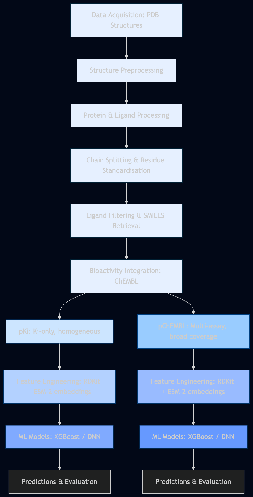

# **Protein–Ligand Binding Affinity Database & ML Pipeline**

## **Summary**

Drug discovery increasingly relies on predicting protein–ligand interactions, but publicly available datasets often suffer from fragmented structural data, inconsistent ligand representations, and heterogeneous bioactivity measurements.  
This project implements a fully reproducible, structure-anchored pipeline that integrates high-quality structural data from the [Protein Data Bank](https://www.rcsb.org/) with curated bioactivity records from [ChEMBL](https://www.ebi.ac.uk/chembl/).  
It produces ML-ready datasets with standardized molecular representations, reliable binding affinity labels (pKi and pChEMBL), and rich features including [RDKit](https://www.rdkit.org/) descriptors and [ESM-2](https://github.com/facebookresearch/esm) protein embeddings.  
The resulting pipeline supports robust ML model training and evaluation under realistic pharmaceutical generalization scenarios, enabling prediction of protein–ligand binding affinity and hit identification.

## **Context and Motivation**

The rapid growth of structural and bioactivity data in public repositories such as the Protein Data Bank (PDB) and ChEMBL has created unprecedented opportunities for applying machine learning to drug discovery. Modern ML approaches can learn patterns from large-scale biochemical data to support tasks such as protein–ligand interaction prediction, binding affinity estimation, hit identification, and lead optimisation.

However, the performance and reliability of ML models critically depend on the availability of large, well-curated, and structurally grounded datasets. In practice, publicly available resources such as PDBbind, BindingDB, and ChEMBL present several limitations for machine learning applications. Structural and bioactivity information is often fragmented across databases, assay conditions are heterogeneous, ligand representations may be inconsistent, and dataset construction pipelines are rarely reproducible. These issues introduce noise, bias, and label inconsistencies that can significantly impact model generalisation.

This project addresses these challenges by implementing a fully reproducible, structure-anchored data pipeline that integrates structural information from the PDB with curated bioactivity measurements from ChEMBL. The resulting dataset links experimentally determined protein–ligand complexes with standardised molecular representations and curated affinity labels, producing an ML-ready resource for binding affinity prediction.

Key design decisions of the pipeline directly address common limitations of existing datasets:

- **Structure–activity linkage:** ChEMBL bioactivity records are connected to experimentally determined PDB co-crystal structures through UniProt and InChIKey cross-referencing.
- **Ligand standardisation:** all molecules are converted to canonical RDKit SMILES to ensure a single representation per compound.
- **Label reliability:** pre-flight validation removes obsolete or unreleased PDB entries before dataset construction.
- **Assay heterogeneity handling:** two parallel affinity branches (pKi and pChEMBL) allow comparison between homogeneous Ki measurements and broader multi-assay data.
- **Bias-aware evaluation:** model performance is assessed using blind protein and blind ligand splits in addition to standard test partitions.
- **Sequence consistency:** extensive mapping of non-standard residues ensures consistent protein sequence representations for downstream feature extraction.

Together, these design choices enable the construction of a reproducible and structurally grounded dataset suitable for machine learning applications in drug discovery.

## **Description**

This repository implements a fully automated, modular data pipeline for constructing a high-quality, structure-anchored protein–ligand binding affinity dataset, and training binary classifiers for binding activity prediction. It is designed to support machine learning model development for drug discovery applications in the pharmaceutical industry.
The pipeline proceeds in six stages:

Data acquisition from RCSB PDB with pre-flight integrity validation
- Structural cleaning:CIF/ENT format unification, water removal, UniProt mapping extraction;
- Sequence & ligand processing; per-chain splitting, residue standardisation, multi-stage chemical filtering, SMILES retrieval;
- Bioactivity integration: ChEMBL cross-referencing via UniProt/InChIKey, pKi and pChEMBL label curation with z-score deduplication;
- Feature engineering — RDKit molecular descriptors (~200 features) and ESM-2 650M protein language model embeddings (1280 dimensions);
- Model training & evaluation — XGBoost and DNN binary classifiers, both optimised via Optuna TPE and evaluated on six data partitions including blind protein and blind ligand generalisation sets.

Two parallel label branches are maintained throughout: pKi (equilibrium binding constant, Ki-only, homogeneous) and pChEMBL (ChEMBL-standardised multi-assay affinity, broader coverage). Both share an activity threshold of ≥ 6.5 (corresponding to Ki/IC50 ≤ ~316 nM), a widely used convention for separating drug-like hits from weak binders.

## **Pipeline Overview**

The pipeline consists of six major stages:

1. **Data acquisition**
   - Retrieval of PDB structures and integrity validation

2. **Structure preprocessing**
   - Format standardisation (CIF → ENT)
   - Water removal
   - UniProt mapping extraction

3. **Protein and ligand processing**
   - Chain splitting
   - residue normalisation
   - ligand filtering
   - SMILES retrieval

4. **Bioactivity integration**
   - ChEMBL cross-referencing
   - pKi / pChEMBL label curation
   - duplicate resolution

5. **Feature engineering**
   - RDKit molecular descriptors
   - ESM-2 protein embeddings

6. **Model training and evaluation**
   - XGBoost and DNN classifiers
   - Optuna hyperparameter optimisation
   - multi-axis generalisation evaluation



## **Folder Sctructure**

```text
protein-ligand-binding-affinity-database-&-ML-pipeline
│
├── README.md                     # Project overview
├── LICENSE                       # License file
├── .gitignore                    # Files/folders to ignore in git
├── requirements.txt              # Python dependencies
├── environment.yml               # Conda environment (optional)
├── Dockerfile                    # Docker configuration for reproducibility
│
├── configs/                      # Configuration files
│
├── data/                         # Project data
│   ├── raw/                      # Original, unmodified data
│   │   ├── pdb_files/            # PDB ID list files
│   │   └── pdb_current_19_02_2025/ # List of current PDBs up to date
│   │
│   ├── interim/                  # Intermediate outputs from pipeline steps
│   │   ├── fasta_sequences/
│   │   ├── split_pdb_files/ 
│   │   ├── fasta_sequences_filtered/  
│   │   ├── split_pdb_files_filtered/
│   │   ├── uniprot_datasets/ 
│   │   ├── ligands_datasets/
│   |   └── filtered_datasets/ 
|   |
|   ├── features/                    # Features outputs from pipeline steps
│   │   ├── chembl_activities/
│   |   ├── esm_embeddings/                
│   |   └── rdkit_descriptors/ 
│   │
│   ├── processed/                  # Final ML-ready datasets
│   |   ├── features_processed_pki/
│   |   └──  features_processed_pchembl/   
│   |
│   └── models/                     #Results from ML models
│       ├── xgboost_pchembl/
│       ├── xgboost_pki/ 
│       ├── dnn_pchembl/
│       └── dnn_pki/
│
├── src/                          # Source code
│   ├── data_preparation/         # Stepwise scripts organized by pipeline steps
│   │   ├── 00_validation_pdbs/
│   │   ├── 01_download_pdbs/
│   │   ├── 02_clean_pdb_and_cif_files/
│   │   ├── 03_clean_ent_files/
│   │   ├── 04_convert_cif_to_ent/
│   │   ├── 05_split_ent_by_chain_ambiguos/
│   │   ├── 06_filter_ligands_get_smiles/
│   │   ├── 07_filtered_proteins/
│   │   └── 08_filtering_fasta_ent_files/
│   │
│   ├── features/                    # Code for embeddings, descriptors and activities
│   │   ├── 09_chembl_bioactivities/
│   │   ├── 10_filter_chembl/
|   |   |   ├── pki
│   │   |   └── pchemb/
│   │   └── 11_feature_ligand_protein_extraction/
|   |       ├── pki
│   │       └── pchemb/ 
|   | 
│   ├── preprocessing/                    # Scripts for preprocessing the data for ML models
│   │   ├── 12_preprocessing_features/
|   |   |   ├── pki
│   │   |   └── pchemb/
│   │   └── 13_train_test_split/  
|   |       ├── pki
│   │       └── pchemb/           
│   │
│   └── models        #ML models
│       ├── xgboost
|       |   ├── pki/
│       │   └── pchemb/ 
│       └── dnn
|           ├── pki/
│           └── pchemb/         
│
├── pipelines/                    # Scripts to run full or partial pipelines
│   ├── run_data_preparation_pipeline.py
│   ├── run_features_pipeline.py
|   ├── run_preprocessing_pipeline.py
|   ├── run_models_pipeline.py
│   └── run_full_pipeline.py                  
│
├── notebooks/                     # Jupyter notebooks for EDA or visualization
│   ├── exploratory_data_analysis.ipynb
|   ├── leakage_analysis.ipynb
|   ├── ligand_chemistry_analysis.ipynb
|   ├── protein_embeddings_analysis.ipynb
|   └── model_analysis.ipynb
│
├── results/                       # Generated results like tables and figures
│   ├── tables/
│   └── figures/
│
└── docs/                          # Additional documentation
    ├── pipeline_architecture.md
    ├── dataset_card.md
    ├── reproducibility.md
    ├── feature_engineering.md
    └── model_strategy.md
```
## **Modeling Design Decisions**

Several design choices were made to ensure that the resulting dataset and models are robust, interpretable, and suitable for realistic drug discovery scenarios.

**Dual affinity label branches**
Two parallel affinity datasets are maintained throughout the pipeline:

- **pKi dataset** — derived exclusively from Ki binding assays, providing thermodynamically meaningful and assay-homogeneous measurements. This dataset is smaller but offers higher label reliability and is well suited for benchmarking tasks or comparisons with physics-based methods.
  
- **pChEMBL dataset** — derived from ChEMBL-standardised activity values integrating multiple assay types (Ki, Kd, IC50, EC50). This branch provides broader coverage of protein–ligand pairs at the cost of increased experimental heterogeneity, making it suitable for large-scale ML model training.

Both datasets apply an activity threshold of **pAffinity ≥ 6.5** (≈ 316 nM), a commonly used cutoff for distinguishing active compounds from weak binders in drug discovery.

**Conservative activity deduplication**
Conflicting bioactivity measurements for identical *(molecule, protein)* pairs are resolved using **z-score filtering**. Measurements within \|z\| ≤ 1 of the group mean are retained, and when all values are outliers the observation closest to the mean is preserved. This conservative approach reduces label noise compared with the standard ChEMBL curation threshold.

**Feature representation**
The modelling pipeline combines:

- **RDKit molecular descriptors** (~200 features) capturing interpretable physicochemical properties of ligands
- **ESM-2 protein language model embeddings** (1280 dimensions) encoding protein sequence features learned from large-scale biological data

This hybrid representation provides a strong baseline for binding affinity prediction while enabling inference for proteins lacking experimentally determined structures.

**Bias-aware evaluation**
Model performance is evaluated using multiple data partitions including **blind protein** and **blind ligand** splits. These partitions reflect key generalisation challenges in pharmaceutical ML: interpolation within known data, extrapolation to unseen protein targets, and extrapolation to novel chemical scaffolds.

Together, these design choices prioritise label reliability, scalable feature representations, and evaluation protocols aligned with real-world drug discovery scenarios.

## **Evaluation Framework**
Model performance is assessed across six complementary dataset partitions, designed to test robustness under realistic drug discovery generalization scenarios:
- Random split
- Scaffold split
- Blind protein split
- Blind ligand split
- Blind protein family split
- Blind ligand scaffold split
All models are evaluated on five held-out partitions (validation is used only during training) using a set of metrics tailored for imbalanced binary classification in pharmaceutical datasets. The decision threshold is 0.5 for all classification metrics.

| Metric | Rationale |
|--------|-----------|
| **AUC-ROC** | Threshold-independent; measures overall ranking ability across all decision thresholds. Primary metric for model selection. |
| **MCC (Matthews Correlation Coefficient)** | Best single metric for imbalanced binary classification — accounts for all four confusion matrix cells. Preferred for pharmaceutical activity data. |
| **F1 Score** | Harmonic mean of precision and recall. Used as the **Optuna optimization objective** during hyperparameter tuning. |
| **Recall (Sensitivity)** | True positive rate — critical in virtual screening where missing actives is costly. |
| **Precision** | Positive predictive value — important for candidate prioritization. |
| **Accuracy** | Reported for completeness; should be interpreted alongside MCC and F1 for imbalanced classes. |

## **Quick Start**

Clone the repository:

git clone https://github.com/yourname/protein-ligand-affinity-ml-pipeline

Install dependencies:

pip install -r requirements.txt

Run the full pipeline:

python pipelines/run_full_pipeline.py

## **Future Work**

- Incorporate atomic distance calculations and residue–ligand contact maps to capture fine-grained structural interactions;
- Implement graph-based neural network models to leverage 3D structural information of protein-ligand complexes;
- Integrate AlphaFold or RoseTTAFold predicted structures to extend coverage to proteins without experimental structures;  
- Develop multi-task models to predict multiple bioactivity measures (Ki, Kd, IC50, EC50) simultaneously;
- Incorporate docking scores and rapid molecular dynamics simulations to enhance binding affinity predictions;
- Automate dataset updates from PDB and ChEMBL, enabling continuous retraining and benchmarking.


